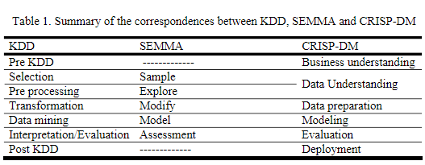
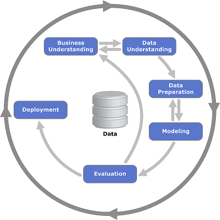

```{r setup, include=FALSE}
knitr::opts_chunk$set(echo = TRUE)
```

## Ejercicio Sesión 2

### Un caso de éxito de CRM: Amazon

<p align="justify">
Jeff Bezos fue su fundador en 1994. Comenzó como una librería en línea que ofrecía libros en Estados Unidos y otros 45 países. Gracias a sus negocios virtuales pudo ofrecer 4 veces más de lo que una librería tradicional ofrecía por esos tiempos. 
</p>

<p align="justify">
Según la American Consumer Association, Amazon tuvo un 88% de clientes satisfechos con el servicio proporcionado, en los años 2002 y 2003, una cifra altísima para una empresa de servicios que no trata cara a cara con los cliente
</p>

<p align="justify">
Amazon contempla su éxito estratégico en la adopción de los medios digitales, puesto ve en ellos un canal más efectivo para llegar a muchos más clientes de forma más rápida. 
</p>

<p align="justify">
Así mismo establece que por medio del mundo digital se podría ofrecer muchos más productos que en forma física, y es un hecho, puesto que en el mundo virtual las fronteras de las bodegas de almacenaje no existen metafóricamente hablando
</p>

### Asignación

<p align="justify">
En una breve nota discute: cual de los procesos KDD, SEMMA y CRISP-DM mejor aplican a cada uno de los casos. En otras palabras ¿cual usarian ustedes para ejecutar la asignación?
</p>


### Selección del proceso para el caso propuesto

<p align="justify">
Después de analizar los procesos nuevamente, puede verse que comparten muchas ideas y métodos entre sí y como puede notarse en la siguiente tabla comparativa, cada proceso suele tener una paso que tiene un equivalente en los otros 2:
</p>


<br>

<p align="justify">
Creo que un buena metodología para este caso de Amazon, sería CRISP-DM, ya que las otras 2 se definen como procesos lineales, mientras que CRIPS-DM puede iterar las veces que sean necesarias si en el proceso de evalucación se determina que no se obtuvo el resultado deseado.
</p>



<p align="justify">
Considero que este proceso iterativo es valioso para el caso de Amazon, ya que al ser una implementación no tan común en la época, se necesitaría volver varias veces a analizar la lógica de negocios antes de conseguir un resultado satisfactorio.
</p>