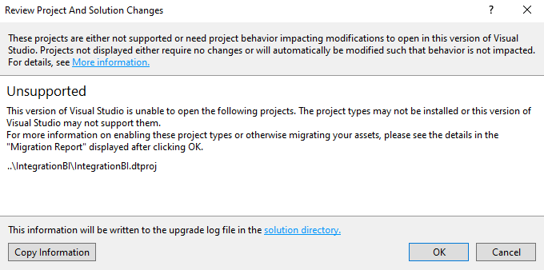

```{r setup, include=FALSE}
knitr::opts_chunk$set(echo = TRUE)
```

## Ejercicio Sesion 3

En el curso mostramos el ejemplo de un Data Warehouse en SQL Server. Compartimos la carpeta donde estan los backups de las bases de datos:

 - BI_SA
 - BI_DW
 - BI

y un proyecto 

 - IntegrationBI 

Que muetra ejemplos de los ETL correspondientes.

Vuelve a cargar las base de datos y levanta el ejemplo para poder correr el ejemplo.

Dejamos esta tarea como instructiva y de ilustración. Solo necesitas enviar una confirmación que trabajaste con el ejemplo para profundizar la teoria.


### Ejecución del proyecto

Para comenzar, mencionaré que no fui capaz de correr el proyecto, intenté utilizar Microsoft Visual Studio 2010, 2015 y 2019, pero al intentar cargar el proyecto con cualquiera de estas versiones, obtuve siempre el mismo resultado, sin importar cuantas dependencias instalara:




Por lo tanto, tomando en cuenta la sugerencia mencionada por el profesor en la clase 7, decidí ver el siguiente video donde se explica el proceso que se llevó a cabo en este proyecto:
https://www.youtube.com/watch?v=2oItzU-tuLA

